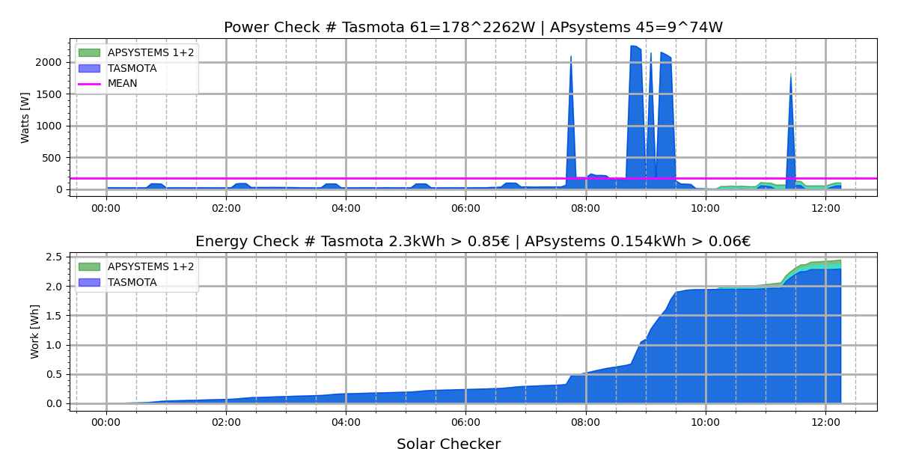
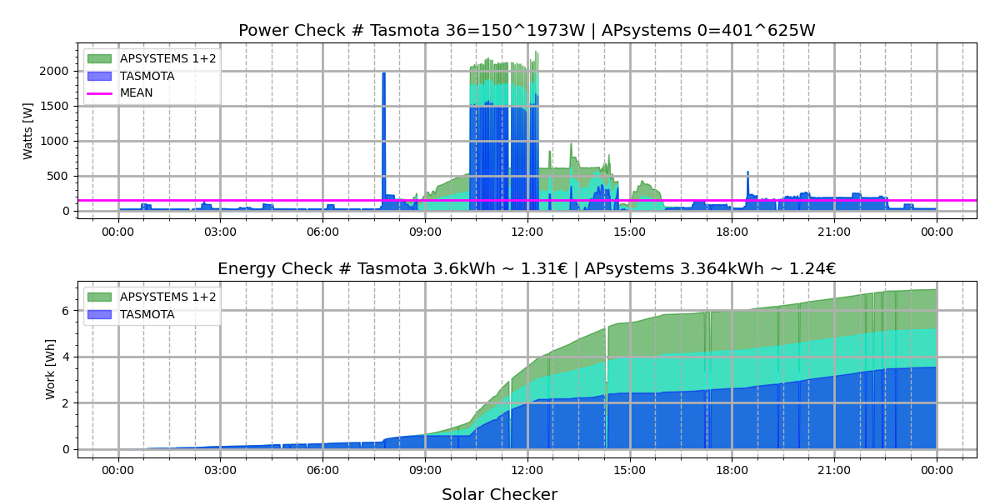

# Solar Checker -  Python Library

## Overview

The Solar Checker Python library provides APIs for the APsystems EZ1
Microinverters, Tasmota smartmeter and a poor Tuya library for
smartplugs. Based on these three APIs there are scripts to record
their latest power data which in turn can be used for plots to
visualise them. It facilitates the process to monitor a solar power
station and to assess if it will pay off at a point of time.

---

## Setup your Inverter

The local API access needs to be activated once in the settings of the APsystems Easy Power App. 
<ul>
<li>Step 1: Connect to the inverter using the "Direct Connection" method.</li>
<li>Step 2: Establish a connection with your inverter.</li>
<li>Step 3: Select the Settings menu.</li>
<li>Step 4: Switch to the "Local Mode" section.</li>
<li>Step 5: Activate local mode and select "Continuous"</li>
<li>Step 6: By some magic the inverter will be added to your Homenet. It runs an HTTP server on port 8050</li>
</ul>

---

## Setup Tasmota for your Smartmeter

There are a lot of tutorials on how to setup Tasmota for a smartmeter
on the internet.

---

## Setup Tuya for your Smartplug

Install the 'tinytuya' package and run the magic 'python3 -m tinytuya
scan'. Follow the interesting instructions in that repository!

These will produce some json file to be used to setup the config file
'.poortuya'. There is a tepmplate in the directory 'poortuya'.

Ensure you have a proper '.poortuya' is in your home directory!

---

## Installation

I installed the 'apsystems', the 'tosmota' and the 'poortuya' APIs on
a standard raspberry buster system with python version 3.7.3. In order
to use the scripts the python3-numpy, python3-pandas,
python3-matplotlib packages have to be installed with 'apt' in
advance. I used 'sudo' for a system wide install avoiding to deal with
local paths and local pip libraries in cron. You might have a
different philosophy and use virtual environments.

It should be installable on any Linux with python >= 3.7.1.

I installed the repository also underer 'termux' on my Android
smartphone.

<ul>
<li>Step 1: git clone the repository</li>
<li>Step 2: cd to the directory solar_checker</li>
<li>Step 3: install with pip</li>
</ul>

```bash
git clone https://github.com/r09491/solar_checker.git
cd solar_checker
sudo pip3 install .
```

For the recording in the script 'solar_checker_latest_once.sh' adapt
the ip addresses and add it to 'cron'. Be sure to have the 'PATH and
'SOLAR_CHECKER_STORE_DIR* environment variables set as documented in
the script!

---

## Examples

The following examples show the setting of the maximum power limit of
the APsystem EZ1 micro inverter. Be advised that there might be
restrictions covered by national laws. Especially in Germany the
maximum power limit is still 600W.

Currently the sun is not shining and snow covers the panels. They do
not provide power to the inverter.

```bash
~/solar_checker $ apsystems_max_power_set.py --ip apsystems --max_power 799
ERROR:apsystems_max_power_set.py:Cannot connect to inverter.
~/solar_checker $
```

Some time later it becomes brighter and the panels deliver at least some
power.

```bash
~/solar_checker/scripts $ apsystems_max_power_set.py --ip apsystems
INFO:apsystems_max_power_set.py:Current Max Power Limit: 300W
~/solar_checker/scripts $ apsystems_max_power_set.py --ip apsystems --max_power 800
INFO:apsystems_max_power_set.py:The power limit for inverters in Germay is 600W.
INFO:apsystems_max_power_set.py:Be advised to consult your lawyer!
INFO:apsystems_max_power_set.py:Current Max Power Limit: 300W
INFO:apsystems_max_power_set.py:Commanded Power: 800W
INFO:apsystems_max_power_set.py:New_Power: 800W
INFO:apsystems_max_power_set.py:Commanded Power Status: ON
INFO:apsystems_max_power_set.py:New Power Status: ON
~/solar_checker/scripts $ apsystems_max_power_set.py --ip apsystems --max_power 600
INFO:apsystems_max_power_set.py:Current Max Power Limit: 800W
INFO:apsystems_max_power_set.py:Commanded Power: 600W
INFO:apsystems_max_power_set.py:New_Power: 600W
INFO:apsystems_max_power_set.py:Commanded Power Status: ON
INFO:apsystems_max_power_set.py:New Power Status: ON
~/solar_checker/scripts $
```

Have a look at the current power and total energy consumed in your house!

```bash
~/solar_checker/scripts $ tasmota_latest_get.py --ip tasmota| \
                             awk -F',' '{printf("Power:%.0fW\nEnergy:%.0fkWh\n", $2,$3)}'
Power:4W
Energy:4227kWh
~/solar_checker/scripts $ apsystems_latest_get.py --ip apsystems
24,0.032,0.698,24,0.029,0.658
~/solar_checker/scripts $ apsystems_latest_get.py --ip apsystems| \
                          awk -F',' '{printf("Channel1: %.0fW %.3fkWh %.3fkWh\n", $1, $2,$3)}'
Channel1: 26W 0.034kWh 0.700kWh
~/solar_checker/scripts $ apsystems_latest_get.py --ip apsystems| \
                         awk -F',' '{printf("Channel 1: %.0fW %.3fkWh %.3fkWh\nChannel 2: %.0fW %.3fkWh %.3fkWh\n", $1,$2,$3,$4,$5,$6)}'
Channel 1: 25W 0.035kWh 0.701kWh
Channel 2: 24W 0.032kWh 0.661kWh
~/solar_checker/scripts $
```

Finally Have a look at the daily  recordings!

```bash
~/solar_checker $ solar_checker_plot.sh
~/solar_checker $
```

The green areas represent the power and energy produced by the
panels. The blue areas represent the power and energy imported from
the commerical net. Oh dear! I wonder if my panels will ever pay off!



A few days later on a cold winter day in January with blue sky, no
clouds, visbility 9999, and temperatures down to -10 degrees! Things
look better! I am happy with my new bifaciale panels starting
harversting shortly before sun rise already! The inverter has to block
their power output at 600W during noon! Propably 800W were possible
without legal restrictions!  At about 15:00 there is a gap for about a
quarter of an hour caused by my neigbour's chimney about 50 m away. I
was not aware of any shade on my house. But this will disappear in the
next days when the sun rises higher. I donate too much energy. I need
a storage.


---
