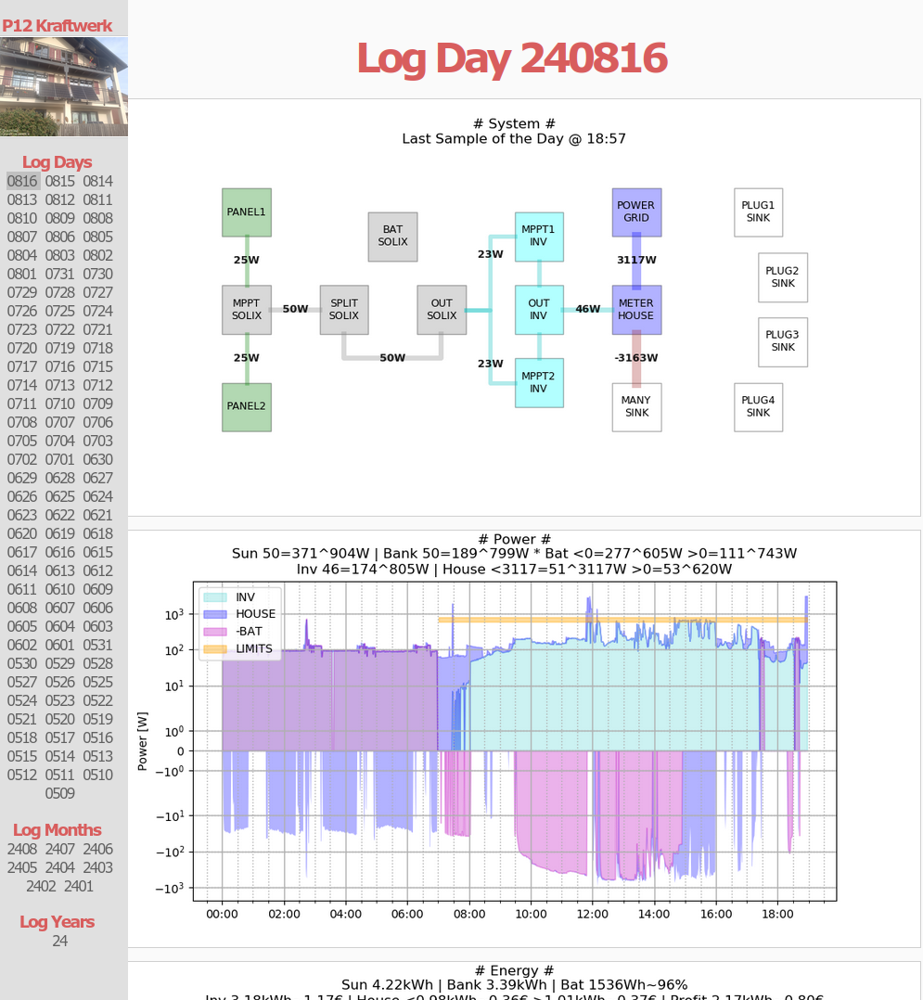
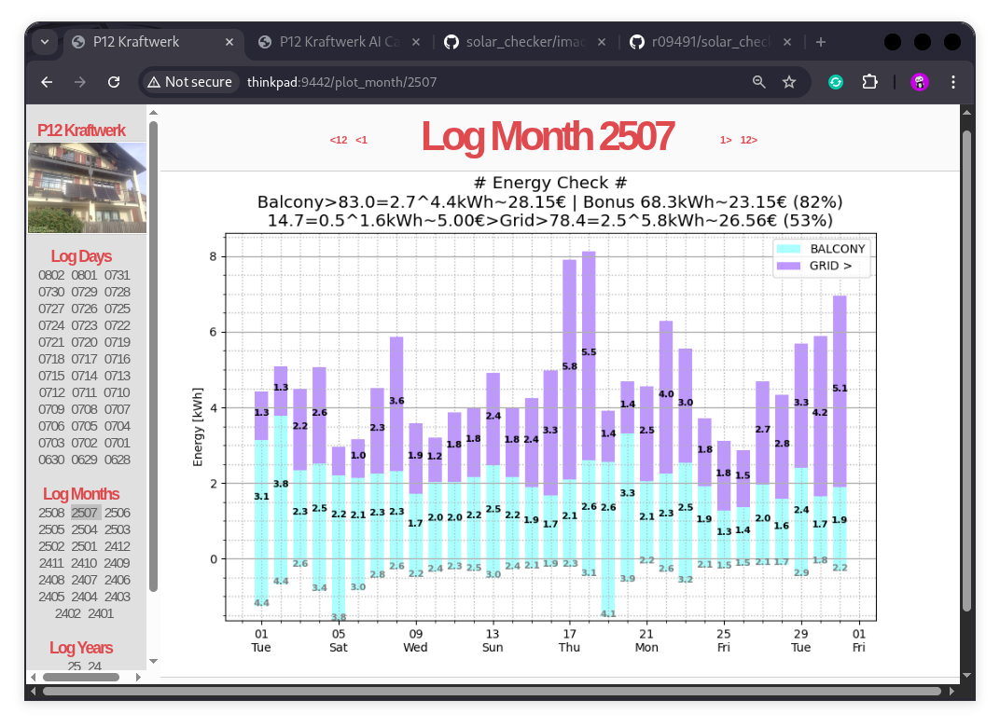

# Solar Checker -  Python Libraries

## Overview

The Solar Checker repository provides APIs for the APsystems EZ1
microinverter, Tasmota smartmeter, Tuya smartplug, Anker Solix
solarbank, Ecoflow Delta Max power station, and the Brightsky weather
server. Based on these there are scripts to record continuously the
power of my PV system (2*440VA panels -> Anker Solix Solarbank gen.1 ->
APsytems inverter) which in turn are used for plots, grid zeroise and
forecasts with output on consoles and web browsers.

Initially motivated to assess my PV system if it will pay off at a
point of time the Anker API was hacked to set the home load power of
the solarbank to control the power grid export later.  Finally rule
and KI based forecast functions were added.

'solar_checker_ai_train.py' will train forecast models based on all or
a subset of disk recorded data.

'solar_checker_ai_predict.py' outputs the forecast for any day using
these models.

The following is a log day on the HTTP server. It shows the system
componens with the power flow in minutes on top.



For each month and year an overview can be calculated showing the
power imported from the grid in blue and the inverter output in
cyan. Positive cyan values are consumed in the home, negative
cyan values are donated to the power grid.



My solar system produced 83.0 kWh measured by the inverter (without
the losses in the solarbank). 82% are directly used which results in a
bonus of 23.15€. Nevertheless I still have to pay 26.56€ to my
supplier for his grid imports and he gets energy worth 5.00€ as a
gift for my grid exports.

---

## Setup your Inverter

The local API access needs to be activated once in the settings of the
APsystems Easy Power App.
<ul>
<li>Step 1: Connect to the inverter using the "Direct Connection" method.</li>
<li>Step 2: Establish a connection with your inverter.</li>
<li>Step 3: Select the Settings menu.</li>
<li>Step 4: Switch to the "Local Mode" section.</li>
<li>Step 5: Activate local mode and select "Continuous"</li>
<li>Step 6: By some magic the inverter will be added to your Homenet. It runs an HTTP server on port 8050</li>
</ul>

---

## Setup Tasmota for your Smartmeter

There are a lot of tutorials on how to setup Tasmota for a smartmeter
on the internet.

---

## Setup Poortuya for your Smartplug

Install the 'tinytuya' package and run the magic 'python3 -m tinytuya
scan'. Follow the interesting instructions in that repository!

These will produce some json files to be used to setup the config file
'.poortuya'. There is a tepmplate in the directory 'poortuya'.

Ensure you have a proper '.poortuya' is in your home directory!

---

## Setup Pooranker for your Solarbank

Install the anker-solix-api
[repositiory](https://github.com/thomluther/anker-solix-api-2)

if you want to install on a Raspberry with Python 3.7 clone the
[fork](https://github.com/r09491/anker-solix-api-2.git) and run ''pip3
install .' Ths repository is a quick and dirty patch of the original
one to run on systems with Python 3.7 only and Solix generation 1.

## Installation

I installed all APIs on a standard raspberry buster system with Python
3.7.3. In order to use the scripts the python3-asyncio,
python3-aiohttp ,python3-numpy, python3-pandas, python3-matplotlib,
python-scipy packages have to be installed with 'apt' in advance. I
used 'sudo' for a system wide install avoiding to deal with local
paths and local pip libraries in cron. You might have a different
philosophy and use virtual environments.  It should be installable on
any Linux with python >= 3.7.1.

I installed the repository also under 'termux' on my Android
smartphone.

<ul>
<li>Step 1: git clone the repository</li>
<li>Step 2: cd to the directory solar_checker</li>
<li>Step 3: install with pip</li>
</ul>

```bash
git clone https://github.com/r09491/solar_checker.git
cd solar_checker
sudo pip3 install .
```

For the recording in the script 'solar_checker_latest_once.sh' adapt
the ip addresses and add it to 'cron'. Be sure to have the 'PATH and
'SOLAR_CHECKER_STORE_DIR* environment variables set as documented in
the script!

To start the http server run 'p12run' under the server/main directory.

You may have to addapt some ip addresses in the scripts.

An example for 'cron' setup wit some docu is in 'scripts/crontab.example'.

---

## Examples

The following examples show the setting of the maximum power limit of
the APsystem EZ1 micro inverter. Be advised that there might be
restrictions covered by national laws. Especially in Germany the
maximum power limit is still 600W.

Currently the sun is not shining and snow covers the panels. They do
not provide power to the inverter.

```bash
~/solar_checker $ apsystems_max_power_set.py --ip apsystems --max_power 799
ERROR:apsystems_max_power_set.py:Cannot connect to inverter.
~/solar_checker $
```

Some time later it becomes brighter and the panels deliver at least some
power.

```bash
~/solar_checker/scripts $ apsystems_max_power_set.py --ip apsystems
INFO:apsystems_max_power_set.py:Current Max Power Limit: 300W
~/solar_checker/scripts $ apsystems_max_power_set.py --ip apsystems --max_power 800
INFO:apsystems_max_power_set.py:The power limit for inverters in Germay is 600W.
INFO:apsystems_max_power_set.py:Be advised to consult your lawyer!
INFO:apsystems_max_power_set.py:Current Max Power Limit: 300W
INFO:apsystems_max_power_set.py:Commanded Power: 800W
INFO:apsystems_max_power_set.py:New_Power: 800W
INFO:apsystems_max_power_set.py:Commanded Power Status: ON
INFO:apsystems_max_power_set.py:New Power Status: ON
~/solar_checker/scripts $ apsystems_max_power_set.py --ip apsystems --max_power 600
INFO:apsystems_max_power_set.py:Current Max Power Limit: 800W
INFO:apsystems_max_power_set.py:Commanded Power: 600W
INFO:apsystems_max_power_set.py:New_Power: 600W
INFO:apsystems_max_power_set.py:Commanded Power Status: ON
INFO:apsystems_max_power_set.py:New Power Status: ON
~/solar_checker/scripts $
```

Have a look at the current power and total energy consumed in your house!

```bash
~/solar_checker/scripts $ tasmota_latest_get.py --ip tasmota| \
                             awk -F',' '{printf("Power:%.0fW\nEnergy:%.0fkWh\n", $2,$3)}'
Power:4W
Energy:4227kWh
~/solar_checker/scripts $ apsystems_latest_get.py --ip apsystems
24,0.032,0.698,24,0.029,0.658
~/solar_checker/scripts $
```
---
